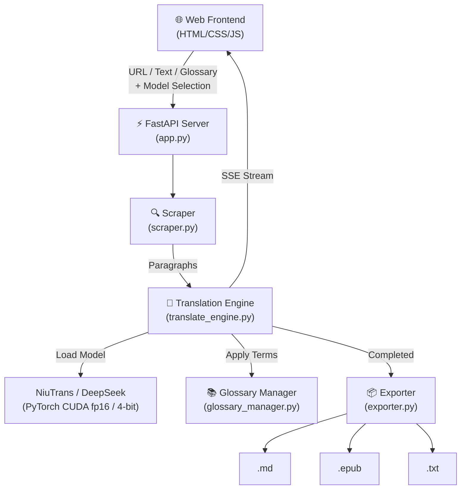

# 📖 Novel Translator — Dịch Truyện Tự Động bằng AI

<div align="center">

**Ứng dụng web dịch truyện tự động từ link web sang Tiếng Việt**
**sử dụng model NiuTrans/LMT-60-1.7B trên GPU**

`FastAPI` · `PyTorch CUDA` · `NiuTrans` · `SSE Streaming` · `EPUB Export`

</div>

---

## ✨ Tính năng

### 🔍 Trích xuất Nội dung Thông minh
- Tự động nhận diện cấu trúc trang từ các web truyện phổ biến
- **Hỗ trợ:** Witch Cult Translations, Syosetu (なろう), Kakuyomu, RoyalRoad, và bất kỳ trang HTML nào (parser mặc định)
- Loại bỏ quảng cáo, thanh điều hướng, donate banner — chỉ giữ lại nội dung truyện

### 🤖 Dịch thuật AI (NiuTrans & DeepSeek)
- Chạy trên **GPU NVIDIA** với chế độ `float16`, tuỳ chọn nén **4-bit** cho card VRAM thấp
- Hỗ trợ **NiuTrans/LMT-60-1.7B** và **DeepSeek-R1-Distill-Qwen-1.5B**
- Chọn model ngay trên giao diện web hoặc qua tham số dòng lệnh
- Dịch **paragraph-by-paragraph** — bảo toàn 100% bố cục gốc
- **Dịch theo batch**, bỏ qua dòng phân cách, cache đoạn trùng lặp
- Hỗ trợ **Pause / Resume / Cancel** — điều khiển linh hoạt
- Tự lùi batch size khi hết VRAM thay vì crash giữa chừng

### 📚 Quản lý Thuật ngữ (Glossary)
- Thêm/xóa/sửa thuật ngữ & tên riêng (VD: `Sword Saint → Kiếm Thánh`)
- Thuật ngữ được đưa thẳng vào prompt (model CausalLM) hoặc thay bằng placeholder (model Seq2Seq)
- Import/export glossary file (`.json` hoặc `.txt`)

### 🖥️ Giao diện Web Hiện đại
- **Dark Mode** sang trọng, hiệu ứng **Glassmorphism**
- **Live Side-by-Side Dual Pane**: Nguyên tác (trái) | Bản dịch (phải) — cập nhật real-time
- **Inline Editor**: Click vào bất kỳ đoạn dịch nào để chỉnh sửa
- **Thanh tiến độ**: %, tốc độ dịch, ETA

### 📦 Xuất File
| Định dạng | Mô tả |
|-----------|-------|
| **Markdown (.md)** | YAML frontmatter, chuẩn Obsidian/Notion |
| **EPUB (.epub)** | Bìa sách, mục lục, CSS đọc sách — cho Kindle, Kobo, Boox |
| **TXT (.txt)** | Plain text đơn giản |

---

## 🚀 Cài đặt & Khởi chạy

### Yêu cầu hệ thống
- **Python** 3.14+
- **GPU NVIDIA** có CUDA — xem bảng VRAM bên dưới
- **CUDA Toolkit** 12.x (tương thích qua driver)
- **Dung lượng đĩa:** ~4 GB cho model tải lần đầu (lưu ở `~/.cache/huggingface`)

### ⚠️ VRAM — đọc trước khi cài

Model `LMT-60-1.7B` ở `float16` chiếm **~3.8 GB VRAM**. Đây là điểm quyết định tốc độ:

| VRAM GPU | Khuyến nghị |
|----------|-------------|
| **< 6 GB** (GTX 1650, 1050 Ti…) | **Bắt buộc** cài `bitsandbytes` để nén 4-bit (~1.4 GB) |
| **6–8 GB** | Chạy fp16 bình thường |
| **≥ 8 GB** | Chạy fp16, batch size lớn hơn |

> Trên Windows, khi VRAM không đủ, driver NVIDIA **không báo lỗi** mà âm thầm tràn
> sang RAM hệ thống qua PCIe. Kết quả là ứng dụng vẫn chạy nhưng chậm đi hàng chục
> lần — cảm giác như bị "đơ". Engine sẽ in cảnh báo khi phát hiện tình trạng này.

### 1. Cài PyTorch (phải làm trước)

```bash
pip install torch --index-url https://download.pytorch.org/whl/cu126
```

> `requirements.txt` **cố tình không liệt kê `torch`**. Nếu liệt kê, pip sẽ kéo về
> bản CPU-only từ PyPI đè lên bản CUDA vừa cài.

### 2. Cài các package còn lại

```bash
pip install -r requirements.txt
```

### 3. (GPU dưới 6GB) Cài thêm bitsandbytes

```bash
pip install bitsandbytes
```

Engine tự phát hiện và bật nén 4-bit khi thấy GPU dưới 6 GB VRAM — không cần cấu hình gì thêm.

### 4. Khởi chạy Web App

```bash
python app.py
```

Mở trình duyệt tại: **http://localhost:8000**

> Lần dịch đầu tiên sẽ mất vài phút để tải và nạp model. Giao diện hiển thị
> trạng thái *"Đang nạp model…"* trong lúc đó — không phải bị treo.

### 5. (Tùy chọn) Sử dụng CLI

```bash
# Dịch từ URL → Markdown (model mặc định)
python translate.py --url "https://witchculttranslation.com/..." --format md

# Dịch bằng DeepSeek-R1-Distill-1.5B
python translate.py --url "https://..." --model "deepseek-ai/DeepSeek-R1-Distill-Qwen-1.5B" --format epub

# Dịch text trực tiếp → TXT
python translate.py --text "Hello world" --format txt

# Dịch từ file
python translate.py --file chapter.txt --lang en --format epub --bilingual
```

---

## 🩺 Xử lý sự cố

| Triệu chứng | Nguyên nhân & cách xử lý |
|-------------|--------------------------|
| **Dịch cực chậm (vài phút/đoạn)** | VRAM không đủ → tràn sang RAM. Cài `bitsandbytes` để nén 4-bit, hoặc đóng các ứng dụng đang chiếm VRAM (trình duyệt, game) |
| **Giao diện đứng im lúc mới bấm Dịch** | Model đang nạp lần đầu. Xem log terminal — engine in `[Engine] Loading …` rồi `Model loaded in …s` |
| **`CUDA out of memory`** | Engine tự giảm batch size và thử lại. Nếu vẫn lỗi ở batch = 1, phải dùng 4-bit hoặc model nhỏ hơn |
| **Chạy trên CPU dù có GPU** | Cài nhầm torch CPU. Kiểm tra: `python -c "import torch; print(torch.cuda.is_available())"` — nếu `False`, cài lại torch theo bước 1 |
| **Bản dịch lẫn văn bản tiếng Anh/giải thích** | Model sinh thêm phần thừa. Engine đã lọc khối `<think>` và tiền tố `"Bản dịch:"`, nhưng model nhỏ vẫn có thể lạc đề ở đoạn dài |
| **`405 Method Not Allowed` hoặc `404` ở `/api/*`** | Trang đang mở bằng **Live Server của VS Code** (cổng `5500`) chứ không phải bằng `app.py`. Live Server chỉ phục vụ file tĩnh nên không có `/api/*`. Chạy `python app.py` rồi mở **http://localhost:8000**. Nếu vẫn muốn dùng Live Server, `app.js` đã tự trỏ API về cổng `8000` — chỉ cần `app.py` đang chạy song song |
| **Mọi request treo ở `pending`, app như bị đơ toàn bộ** | Cửa sổ CMD đang ở **QuickEdit Mode**: click chuột vào console là Windows chặn mọi lệnh ghi stdout, uvicorn kẹt ở dòng access log ngay trên event loop nên cả server đứng. **Bấm `Esc` trong cửa sổ CMD** là chạy lại ngay. Tắt hẳn: chuột phải thanh tiêu đề → Properties → bỏ tick *QuickEdit Mode*, hoặc `reg add "HKCU\Console" /v QuickEdit /t REG_DWORD /d 0 /f`. Dấu hiệu nhận biết: tiến trình dùng 0% CPU nhưng không trả lời request nào |
| **Tải model thất bại / timeout** | Mạng chặn HuggingFace. Đặt biến môi trường `HF_ENDPOINT` sang mirror, hoặc tải thủ công vào `~/.cache/huggingface` |

---

## ⚡ Ghi chú Hiệu năng

Engine áp dụng sẵn các tối ưu sau — hữu ích nếu bạn định sửa `translate_engine.py`:

| Tối ưu | Lý do |
|--------|-------|
| **Ép `config.use_cache = True`** | `config.json` của LMT-60-1.7B đặt `use_cache: false`. Khi đó KV cache bị tắt, mỗi token sinh ra phải tính lại toàn bộ prefix → độ phức tạp `O(n²)` thay vì `O(n)` |
| **`enable_thinking=False`** | Chat template Qwen3 mặc định bật chế độ suy luận. Không tắt thì mỗi đoạn sinh cả khối `<think>…</think>` dài hơn cả bản dịch |
| **Greedy decoding** (`do_sample=False`, `num_beams=1`) | Dịch thuật cần ổn định; beam search 4 nhánh tốn gấp 4 lần tính toán mà cải thiện không đáng kể |
| **`max_new_tokens` động** | Tính theo độ dài đầu vào thay vì cố định 1024 — đoạn ngắn không phải chờ sinh dư |
| **Batch generation** | Gộp nhiều đoạn vào một lượt `generate` thay vì gọi tuần tự từng đoạn |
| **Bỏ qua dòng phân cách** | Đoạn kiểu `***`, `---` được giữ nguyên, không tốn lượt gọi model |
| **Cache đoạn trùng** | Truyện có nhiều câu thoại lặp lại — dịch một lần rồi tái sử dụng |
| **Left padding** | Bắt buộc với model decoder-only khi batch, nếu không phần sinh ra sẽ lệch khỏi prompt |
| **Nạp model trong thread pool** | Tránh chặn event loop — nếu không, mọi request khác (kể cả nút Huỷ) sẽ treo trong lúc nạp |
| **Prompt tiếng Việt + mồi sẵn câu trả lời** | Với prompt tiếng Anh, model trả lời bằng đúng ngôn ngữ nguồn thay vì dịch. Đo trên 5 câu tiếng Nhật: prompt cũ đạt 1/5, prompt mới đạt 5/5 |
| **Glossary đưa vào prompt** | Model sinh ngôn ngữ nuốt mất placeholder chèn giữa câu, nên thuật ngữ được liệt kê thành danh sách trong prompt |

---

## 📂 Cấu trúc Dự án

```
Dịch/
├── app.py                    # 🖥️ FastAPI Server — API endpoints + SSE streaming
├── translate_engine.py       # 🤖 Translation Engine — batch, async, pause/resume, 4-bit
├── scraper.py                # 🔍 Web Scraper — strategy pattern cho nhiều domain
├── glossary_manager.py       # 📚 Glossary Manager — CRUD, pre/post processing
├── exporter.py               # 📦 Exporter — tạo file MD, EPUB, TXT
├── translate.py              # 💻 CLI Script — dịch truyện từ command line
├── requirements.txt          # 📋 Dependencies
├── static/
│   ├── index.html            # 🌐 Giao diện web (SPA)
│   ├── style.css             # 🎨 Dark glassmorphic design system
│   └── app.js                # ⚡ Frontend logic — SSE, inline editor, glossary UI
└── storage/                  # 💾 Thư mục lưu file xuất & glossary
    └── glossary.json         # Glossary data (tự tạo)
```

---

## 🔌 API Endpoints

### Scraper
| Method | Endpoint | Mô tả |
|--------|----------|-------|
| `POST` | `/api/scrape` | Trích xuất chương từ URL |
| `POST` | `/api/parse-text` | Tạo task từ văn bản trực tiếp |

### Translation
| Method | Endpoint | Mô tả |
|--------|----------|-------|
| `POST` | `/api/translate/start` | Đánh dấu task sẵn sàng dịch (nhận `model_name`) |
| `GET` | `/api/translate/stream/{task_id}` | **SSE stream** — chạy dịch + stream tiến độ real-time |
| `POST` | `/api/translate/pause/{task_id}` | Tạm dừng |
| `POST` | `/api/translate/resume/{task_id}` | Tiếp tục |
| `POST` | `/api/translate/cancel/{task_id}` | Hủy |
| `GET` | `/api/translate/status/{task_id}` | Lấy trạng thái & kết quả hiện tại |
| `POST` | `/api/translate/edit/{task_id}` | Chỉnh sửa bản dịch (inline edit) |

**Sự kiện SSE** — `event: progress` với payload:

```json
{
  "task_id": "a1b2c3d4",
  "status": "loading | running | paused | completed | cancelled | error",
  "total": 120, "completed": 37, "percentage": 30.8,
  "index": 36, "original": "...", "translated": "...",
  "speed": 1.42, "eta": 58.4,
  "error": "", "message": "Đang nạp model..."
}
```

Kết thúc bằng `event: done`. Trạng thái `loading` được gửi **trước** khi model nạp
xong, để giao diện không đứng im.

### Export
| Method | Endpoint | Mô tả |
|--------|----------|-------|
| `GET` | `/api/export/{task_id}/{fmt}` | Tải file (`md`, `epub`, `txt`). Query: `?bilingual=true` |

### Glossary
| Method | Endpoint | Mô tả |
|--------|----------|-------|
| `GET` | `/api/glossary` | Danh sách thuật ngữ |
| `POST` | `/api/glossary` | Thêm thuật ngữ |
| `DELETE` | `/api/glossary` | Xóa thuật ngữ |
| `DELETE` | `/api/glossary/all` | Xóa tất cả |
| `POST` | `/api/glossary/import` | Import file glossary |
| `GET` | `/api/glossary/export/{fmt}` | Export glossary (`json`, `txt`) |

---

## 🔒 Lưu ý Bảo mật

Ứng dụng được thiết kế để **chạy cục bộ trên máy cá nhân**. Cấu hình mặc định:

- Server bind `0.0.0.0:8000` → **mở ra toàn bộ mạng LAN**, không chỉ máy bạn
- CORS đặt `allow_origins=["*"]` → mọi trang web đều gọi được API
- **Không có xác thực** — ai truy cập được cũng dùng được
- `/api/scrape` nhận URL tuỳ ý → có thể bị lợi dụng để dò mạng nội bộ (SSRF)

Nếu không tin tưởng mạng đang dùng, sửa `app.py` thành `host="127.0.0.1"` để chỉ
cho phép truy cập từ chính máy đó.

---

## 🧩 Kiến trúc



---

## 🛠️ Phát triển Thêm

### Ý tưởng mở rộng

| Tính năng | File cần sửa | Ghi chú |
|-----------|-------------|---------|
| **Thêm domain mới** | `scraper.py` | Tạo class mới kế thừa `BaseParser`, đăng ký vào `PARSER_REGISTRY` |
| **Đổi model mặc định** | `translate_engine.py` | Sửa hằng số `DEFAULT_MODEL` |
| **Thêm model vào dropdown** | `static/index.html` | Thêm `<option>` vào `#select-model` |
| **Thêm ngôn ngữ nguồn** | `translate_engine.py` | Thêm vào **cả hai** `LANGUAGE_NAMES` và `LANGUAGE_NAMES_VI`; thêm `<option>` vào `#input-lang` |
| **Chỉnh chất lượng dịch** | `translate_engine.py` | Sửa `SYSTEM_PROMPT` hoặc tham số trong `_generate()` |
| **Tùy chỉnh EPUB style** | `exporter.py` | Sửa biến `EPUB_CSS` |
| **Thêm format xuất** | `exporter.py` + `app.py` | Tạo hàm `export_xxx()` mới, thêm route |
| **Multi-chapter dịch** | `app.py` + `app.js` | Thêm queue quản lý nhiều chương |
| **Lưu lịch sử dịch** | `app.py` | Thêm SQLite/JSON persistence cho tasks |
| **Xác thực người dùng** | `app.py` | Thêm FastAPI middleware + JWT |

### Thêm một Web Novel Parser mới

```python
# Trong scraper.py, tạo class mới:

class MyNovelSiteParser(BaseParser):
    """Parser cho mynovelsite.com."""

    CONTENT_SELECTORS = [
        ".chapter-text",  # CSS selector chứa nội dung chương
    ]

    def extract_title(self, soup):
        el = soup.select_one(".chapter-title")
        return el.get_text(strip=True) if el else super().extract_title(soup)

# Đăng ký vào registry:
PARSER_REGISTRY["mynovelsite.com"] = MyNovelSiteParser
```

### Đổi Model Dịch

Engine **tự nhận diện kiến trúc model** qua `config.architectures` — không cần
khai báo thủ công là seq2seq hay causal:

```python
# Trong translate_engine.py:

DEFAULT_MODEL = "NiuTrans/LMT-60-1.7B"   # ← đổi ở đây
```

Khi thay bằng model khác, cần kiểm tra:

1. **Kiểu model** — `CausalLM` dùng chat template + prompt hội thoại;
   `Seq2SeqLM` dùng prompt phẳng `"Translate {lang} to Vietnamese: {text}"`.
2. **Chat template** — model dòng Qwen3 có `enable_thinking`; engine tự phát hiện
   và tắt. Model khác có thể cần cách tắt reasoning riêng.
3. **`use_cache`** — kiểm tra `config.json` của model. Engine đã ép `True`,
   nhưng nếu model dùng cơ chế cache riêng thì cần xử lý thêm.
4. **VRAM** — model càng lớn càng cần nén 4-bit trên card yếu.

> Một số họ model có quy ước prompt riêng: NLLB chọn ngôn ngữ qua
> `tokenizer.src_lang` + `forced_bos_token_id`, còn Marian/OPUS-MT dùng tiền tố
> dạng `>>vie<<`. Cả hai đều **không** dùng chat template, nên phải bổ sung
> nhánh xử lý riêng trong `_build_prompt()`.

---

## 📝 Glossary File Format

### JSON
```json
[
  { "source": "Sword Saint", "target": "Kiếm Thánh" },
  { "source": "Witch Factor", "target": "Nhân tố Phù thủy" },
  { "source": "Subaru", "target": "Subaru", "case_sensitive": true }
]
```

### TXT
```
Sword Saint = Kiếm Thánh
Witch Factor = Nhân tố Phù thủy
Subaru = Subaru
```

Dấu phân cách chấp nhận `=`, `:` hoặc Tab. Dòng bắt đầu bằng `#` được bỏ qua.

### Glossary được áp dụng thế nào

Engine dùng hai cơ chế khác nhau tuỳ kiểu model:

| Kiểu model | Cơ chế | Ghi chú |
|-----------|--------|---------|
| **CausalLM** (LMT-60, DeepSeek) | Liệt kê thuật ngữ ngay trong prompt | Chỉ những thuật ngữ thực sự xuất hiện trong đoạn mới được đưa vào, nên prompt không phình ra |
| **Seq2Seq** (NLLB, Marian…) | Thay bằng placeholder rồi khôi phục | Model dịch máy bảo toàn được placeholder |

> Cơ chế placeholder **không dùng được** với model sinh ngôn ngữ: nó viết lại
> cả câu nên `⟦TERM_000⟧` bị nuốt mất và không còn gì để khôi phục. Vì vậy với
> CausalLM, glossary là **chỉ dẫn** chứ không phải thay thế cứng — độ tuân thủ
> tốt nhưng không tuyệt đối 100%.

---

## ⚙️ Cấu hình

| Biến | Vị trí | Mặc định | Mô tả |
|------|--------|----------|-------|
| `DEFAULT_MODEL` | `translate_engine.py` | `NiuTrans/LMT-60-1.7B` | Model HuggingFace mặc định |
| `MAX_INPUT_TOKENS` | `translate_engine.py` | `768` | Giới hạn token đầu vào mỗi đoạn |
| `MAX_NEW_TOKENS_CAP` | `translate_engine.py` | `512` | Trần cứng token sinh ra mỗi đoạn |
| `SYSTEM_PROMPT` | `translate_engine.py` | *(xem file)* | Chỉ dẫn cho model dịch (viết bằng tiếng Việt) |
| `ASSISTANT_PREFILL` | `translate_engine.py` | `Bản dịch tiếng Việt: ` | Mồi sẵn câu trả lời để ép model xuất tiếng Việt |
| `LANGUAGE_NAMES` | `translate_engine.py` | `en`, `ja`, `zh`, `ko` | Tên ngôn ngữ tiếng Anh (cho model Seq2Seq) |
| `LANGUAGE_NAMES_VI` | `translate_engine.py` | `en`, `ja`, `zh`, `ko` | Tên ngôn ngữ tiếng Việt (cho model CausalLM) |
| `STORAGE_DIR` | `exporter.py` | `storage/` | Thư mục lưu file xuất |
| `storage_path` | `glossary_manager.py` | `storage/glossary.json` | File lưu glossary |
| Host/Port | `app.py` | `0.0.0.0:8000` | Địa chỉ server |

`TranslationEngine` còn nhận hai tham số tuỳ chọn để ghi đè cơ chế tự động:

```python
engine = TranslationEngine(
    batch_size=4,        # None = tự chọn theo VRAM còn trống
    load_in_4bit=True,   # None = tự bật khi GPU dưới 6GB
)
```

---

## ⚠️ Giới hạn Hiện tại

- **Task lưu trong RAM.** Tắt server là mất toàn bộ tiến độ. Pause/Resume chỉ hoạt
  động trong một phiên chạy — chưa có persistence (xem mục *Lưu lịch sử dịch*).
- **Mỗi lần một chương.** Chưa có hàng đợi cho nhiều chương.
- **Chất lượng phụ thuộc model 1.7B.** Model nhỏ có thể lạc đề hoặc bỏ sót ở
  những đoạn dài, phức tạp. Dùng glossary để giữ nhất quán tên riêng.
- **Glossary với CausalLM là chỉ dẫn, không phải ràng buộc cứng.** Model tuân
  thủ tốt nhưng vẫn có thể chệch ở câu phức tạp — nên rà lại tên riêng quan
  trọng bằng Inline Editor.
- **Tiếng Nhật khó hơn tiếng Anh.** Model đôi khi diễn giải lại thay vì dịch.
  Prompt hiện tại đã xử lý được các trường hợp thử nghiệm, nhưng văn phong cổ
  hoặc câu rất dài vẫn có thể trượt.

---

## 🤝 Đóng góp

Đọc [AGENTS.md](AGENTS.md) trước khi thay đổi mã nguồn. Tài liệu này mô tả cấu
trúc dự án, quy ước code, cách kiểm thử và yêu cầu với Pull Request.

Quy trình đề xuất:

1. Tạo nhánh riêng và giữ mỗi commit tập trung vào một thay đổi.
2. Tuân theo PEP 8 cho Python; giữ quy ước hiện tại của HTML, CSS và JavaScript.
3. Chạy kiểm tra cú pháp trước khi gửi PR:

   ```bash
   python -m compileall app.py exporter.py glossary_manager.py scraper.py translate.py translate_engine.py
   ```

4. Kiểm thử thủ công các luồng bị ảnh hưởng: nhập URL/text, SSE, Pause/Resume,
   glossary và export. Mock model, GPU và network nếu bổ sung test tự động.
5. Trong PR, mô tả thay đổi, cách kiểm tra, yêu cầu GPU/model và thêm ảnh chụp
   nếu chỉnh sửa giao diện trong `static/`.

Không commit model cache, secret, `__pycache__/` hoặc file đầu ra phát sinh trong
`storage/`.

---

## 📄 License

MIT — Tự do sử dụng và phát triển.

---

<div align="center">

**Powered by [NiuTrans/LMT-60-1.7B](https://huggingface.co/NiuTrans/LMT-60-1.7B) • GPU Accelerated (CUDA)**

</div>
